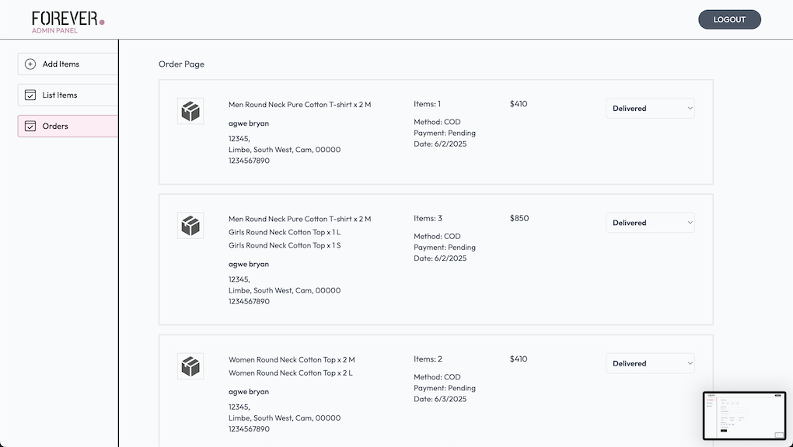

# Forever (E-commerce)

Forever is a modern, full-stack e-commerce web application built with the MERN stack (MongoDB, Express.js, React, Node.js) and designed for a seamless shopping experience. This project demonstrates best practices in web development, scalable architecture, and a beautiful, responsive UI—perfect for your portfolio or as a foundation for a real-world online store.

---

## 🚀 Key Features

- **User Authentication & Authorization**

  - Secure login and registration
  - JWT-based authentication
  - Admin and user roles

- **Product Management**

  - Add, edit, and remove products (admin panel)
  - Upload multiple product images (Cloudinary integration)
  - Product categories, subcategories, and sizes
  - Bestsellers and latest collections

- **Shopping Cart & Orders**

  - Add to cart, update quantities, and remove items
  - Place orders with delivery address and payment method
  - Order history and order status tracking

- **Admin Dashboard**

  - Manage products and orders
  - Update order status (e.g., Packing, Shipped, Delivered)
  - View all users and sales analytics (extendable)

- **Payments**

  - Stripe and Razorpay integration for secure payments
  - Cash on delivery option

- **Responsive & Modern UI**

  - Mobile-first design with Tailwind CSS
  - Fast, smooth navigation (React Router)
  - Toast notifications for user feedback

- **Performance & Best Practices**
  - RESTful API with Express.js
  - MongoDB Atlas for cloud database
  - Environment variables for secure config
  - ESLint and Prettier for code quality

---

## 🖼️ Screenshots

| Home Page                             | Product Details                                 | Collections                                         |
| ------------------------------------- | ----------------------------------------------- | --------------------------------------------------- |
|  |  |  |

| Cart                                  | Place Order                                   | Orders                                    |
| ------------------------------------- | --------------------------------------------- | ----------------------------------------- |
|  |  |  |

| Admin: All Products                                  | Admin: Add Product                                 | Admin: All Orders                                |
| ---------------------------------------------------- | -------------------------------------------------- | ------------------------------------------------ |
|  |  |  |

---

## 🛠️ Tech Stack

- **Frontend:** React, Vite, Tailwind CSS, React Router, Axios
- **Backend:** Node.js, Express.js, MongoDB (Mongoose)
- **Authentication:** JWT
- **File Uploads:** Multer, Cloudinary
- **Payments:** Stripe, Razorpay
- **Deployment:** (Ready for Vercel/Netlify & Render/Railway)

---

## 📦 Getting Started

1. **Clone the repository:**
   ```sh
   git clone https://github.com/your-username/Forever_E-commerce.git
   cd Forever_E-commerce
   ```
2. **Install dependencies:**
   - For backend:
     ```sh
     cd backend
     npm install
     ```
   - For frontend:
     ```sh
     cd ../client
     npm install
     ```
3. **Set up environment variables:**
   - Create `.env` files in both backend and client folders (see `.env.example` if provided)
4. **Run the app locally:**
   - Start backend:
     ```sh
     npm run server
     ```
   - Start frontend:
     ```sh
     npm run dev
     ```

---

## 💡 Potential Improvements

- Add product reviews and ratings
- Implement advanced admin analytics
- Add user profile management
- Integrate email notifications
- Add Stripe and Razorpay functionalities

---

## 📬 Contact

For questions, feedback, or collaboration, please reach out via [agwebryan1@gmail.com] or open an issue on GitHub.

---

**Forever (E-commerce)** — Built with ❤️ by Agwe Bryan 😘
